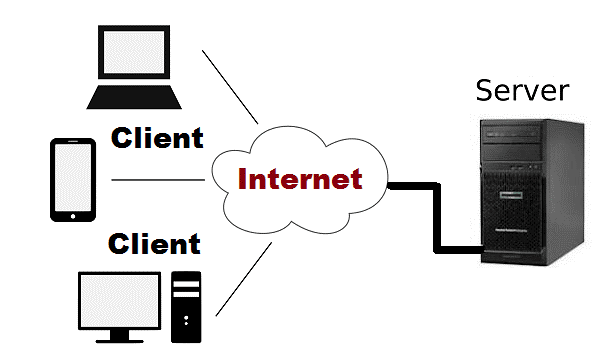

#   Understanding Client-Server Architecture

##  Client-Server Architecture with MYSQL

Client-server architecture is a common approach to building distributed software systems. In this architecture, there are two main components: the client and the server. The client is the user interface, or front-end, of the application, while the server is the back-end that handles data storage and processing. One of the most widely used server-side technologies for data storage is MySQL, an open-source relational database management system. 

Run this command `curl -Iv www.propitixhomes.com` to see client server communication in action.

#   Implementing Client-Server Architecture using MySQL
##  Database Management System (DBMS).

1.  Create and configure two Linux-based virtual servers (EC2 instances in AWS). One named `mysql server` and the other `mysql client`

2.  Install MySQL Server software on EC2 instances

3.  Install MySQL client software on EC2 instances.

4.  Both EC2 instances were launched in the same VPC, so by default they can communicate with each other using their local IP addresses. We will be using the MySQL server's local IP address (private IP) to connect from the MySQL client. MySQL server uses TCP port 3306 by default, so you will have to open it by creating a new entry in ‘Inbound Rules in ‘MySQL Server Security Groups. For extra security, do not allow all IP addresses to reach your ‘MySQL server—allow access only to the specific local IP address of your ‘MySQL client’.

5.  You might need to configure MySQL server to allow connections from remote hosts. To do this, open the MySQL config file and replace `127.0.0.1` to `0.0.0.0` in the “binding-address”

`sudo vi /etc/mysql/mysql.conf.d/mysqld.cnf`

6.  From MySQL client server connects remotely to the MySQL server database engine without using SSH. You must use the MySQL utility to perform this action.

`sudo mysql -h 172.31.16.48 -u remote_user -p`

7.  To confirm that you have successfully perform SQL queries from the client server

Thank you...
